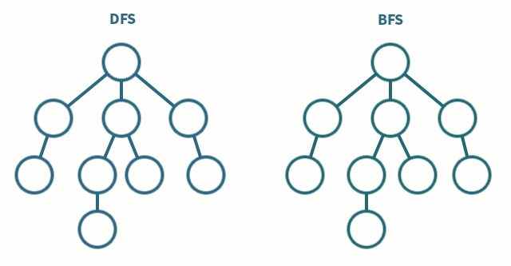

# Inteligência Artificial


## Conteúdos
- [Conceitos](conteudos/topico1-conceitos.pdf)
- [Busca](conteudos/topico2-busca.pdf)
  - [Resumo](#busca)
- Representação do Conhecimento
  - [Raciocício](conteudos/topico3-representacao_de_conhecimento_e_raciocinio.pdf)
  - [Ontologia](conteudos/topico4-representacao_de_conhecimento_ontologias.pdf)
  - [Web Semântica](conteudos/topico5-representacao_de_conhecimento_web_semantica.pdf)
- Agentes
  - [Sistemas Multiagentes](conteudos/topico6-agentes_e_sistemas_multiagentes.pdf)
  - [Sistemas Multiagentes de Negociação](conteudos/topico8-sistemas_multiagentes_negociacao.pdf)
  - [Sistemas Multiagentes de Cooperação](conteudos/topico9-sistemas_multiagentes_cooperacao.pdf)


---

## Busca
- Os métodos de busca são úteis para simplificar soluções.
- São representados por grafos [ nodos (estados) + arestas (ações)]
- O resultado de uma busca retorna um **conjunto de ações** (como montar e como percorrer)
- Devido a otimização de recursos sempre é feito a montagem e percorrimento simultaneamente.

### Características
- Computável
  - solução encontrada em um tempo finito
- Otimizada
  - Sempre encontra a melhor solução
- Recursos limitados
  - Deve utilizar o mínimo de recursos necessários

### Métodos de Busca
- Amplitude (Breadth-first)
  - queue
- Profundidade (Depth-first)
  - stack




<br/>
<br/>
<br/>
<br/>

### Algoritmo de Resolução
Comece com 
- 2 listas
- solução a ser encontrada
- vértices (nodos)


```python
solucao = 'n'

estado_inicial = 'a'
estado_atual = None

lista_nodos_visitados = []
fila = [] # lista_nodos_abertos
```

1. Pegue o nodo `estado_inicial`
```python
solucao = 'n'

estado_inicial = 'a'
estado_atual = 'a'

fila = ['a']
```

2. Verifique se é solução, se não for então remova da `fila` e adicione na `lista_nodos_visitados`
```python
estado_atual = 'a'

lista_nodos_visitados = []
fila = ['a']


if estado_atual is solucao:
    return True
else:
    fila.pop(estado_atual)
    lista_nodos_visitados.append(estado_atual)

    # estado_atual = 'a'
    # lista_nodos_visitados = ['a']
    # fila = []
```

4. Verifique se o `estado_atual` tem filhos, se tiver adicione na `fila`
```python
estado_atual = 'a'

lista_nodos_visitados = ['a']
fila = []


if len(node.estado_atual) > 0:
    fila.append('b')
    fila.append('c')

    # estado_atual = 'a'
    # lista_nodos_visitados = ['a']
    # fila = ['b', 'c']
```

5. Pegue um novo nodo
```python
estado_atual = 'b'
```

**NOTA:** até aqui é tudo igual para os métodos de busca em largura e profundidade.

6. Verifique se é solução, se não for então remova da `fila` e adicione na `lista_nodos_visitados`
```python
estado_atual = 'b'

lista_nodos_visitados = ['a']
fila = ['b', 'c']

if estado_atual is solucao:
    return True
else:
    fila.pop(estado_atual)
    lista_nodos_visitados.append(estado_atual)
```

7. Verifique se o `estado_atual` tem filhos, se tiver adicione na `fila`
```python
estado_atual = 'b'

lista_nodos_visitados = ['a', 'b']
fila = []


if len(node.estado_atual) > 0:
    # largura FIFO
    fila.insert(index=-1, 'd')
    fila.insert(index=-1, 'e')
    # estado_atual = 'b'
    # lista_nodos_visitados = ['a', 'b']
    # fila = ['c', "d", "e"] 


    # profundidade LIFO
    pilha.insert(index=0, 'd')
    pilha.insert(index=0, 'e')
    # estado_atual = 'b'
    # lista_nodos_visitados = ['a', 'b']
    # pilha = ["d", "e", 'c'] 
```


### Largura


<br/>
<br/>
<br/>

### Profundidade


---

#### Referências
- http://how2examples.com/artificial-intelligence/tree-search

---

<p  align="left">
	<br/>
	<a href="mailto:brunocampos01@gmail.com" target="_blank">
	</a>
	<a href="https://stackoverflow.com/users/8329698/bruno-campos" target="_blank">
	</a>
	<a href="https://www.linkedin.com/in/brunocampos01" target="_blank">
	</a>
	<a href="https://github.com/brunocampos01" target="_blank"></a>
	<a href="https://medium.com/@brunocampos01" target="_blank">
	</a>
    <a rel="license" href="http://creativecommons.org/licenses/by-sa/4.0/">
    </a>
    <br/>
</p>

