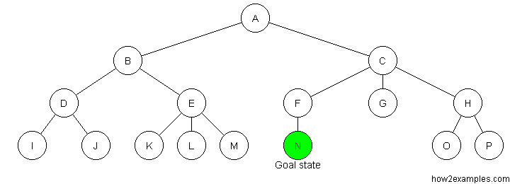

# Inteligência Artificial
[](https://app.codacy.com/manual/brunocampos01/inteligencia-artificial?utm_source=github.com&utm_medium=referral&utm_content=brunocampos01/inteligencia-artificial&utm_campaign=Badge_Grade_Dashboard)

## Busca
- Os métodos de busca são úteis para simplificar soluções.
- São representados por grafos [ nodos (estados) + arestas (ações)]
- O resultado de uma busca retorna um **conjunto de ações** (como montar e como percorrer)
- Devido a otimização de recursos sempre é feito a montagem e percorrimento simultaneamente.

### Características
- Computável
  - solução encontrada em um tempo finito
- Otimizada
  - Sempre encontra a melhor solução
- Recursos limitados
  - Deve utilizar o mínimo de recursos necessários

### Métodos de Busca
- Amplitude (Breadth-first)
  - queue
- Profundidade (Depth-first)
  - stack


<br/>
<br/>
<br/>
<br/>

#### Algoritmo de Resolução
Comece com 
- 2 listas
- solução a ser encontrada
- estados (nodos)


```python
solucao = 'n'

estado_inicial = 'a'
estado_atual = None

lista_nodos_visitados = []
lista_nodos_abertos = []
```

1. Pegue o nodo `estado_inicial`
```python
solucao = 'n'

estado_inicial = 'a'
estado_atual = 'a'

lista_nodos_abertos = ['a']
```

2. Verifique se é solução, se não for então remova da `lista_nodos_abertos` e adicione na `lista_nodos_visitados`
```python
estado_atual = 'a'

lista_nodos_visitados = []
lista_nodos_abertos = ['a']


if estado_atual is solucao:
    return True
else:
    lista_nodos_abertos.pop(estado_atual)
    lista_nodos_visitados.append(estado_atual)

    # estado_atual = 'a'
    # lista_nodos_visitados = ['a']
    # lista_nodos_abertos = []
```

4. Verifique se o `estado_atual` tem filhos, se tiver adicione na `lista_nodos_abertos`
```python
estado_atual = 'a'

lista_nodos_visitados = ['a']
lista_nodos_abertos = []


if len(node.estado_atual) > 0:
    lista_nodos_abertos.append('b')
    lista_nodos_abertos.append('c')

    # estado_atual = 'a'
    # lista_nodos_visitados = ['a']
    # lista_nodos_abertos = ['b', 'c']
```

5. Pegue um novo nodo
```python
estado_atual = 'b'
```

**NOTA:** até aqui é tudo igual para os métodos de busca em largura e profundidade.

6. Verifique se é solução, se não for então remova da `lista_nodos_abertos` e adicione na `lista_nodos_visitados`
```python
estado_atual = 'b'

lista_nodos_visitados = ['a']
lista_nodos_abertos = ['b', 'c']

if estado_atual is solucao:
    return True
else:
    lista_nodos_abertos.pop(estado_atual)
    lista_nodos_visitados.append(estado_atual)
```

7. Verifique se o `estado_atual` tem filhos, se tiver adicione na `lista_nodos_abertos`
```python
estado_atual = 'b'

lista_nodos_visitados = ['a', 'b']
lista_nodos_abertos = []


if len(node.estado_atual) > 0:
    # largura FIFO
    lista_nodos_abertos.insert(index=-1, 'd')
    lista_nodos_abertos.insert(index=-1, 'e')
    # estado_atual = 'b'
    # lista_nodos_visitados = ['a', 'b']
    # lista_nodos_abertos = ['c', "d", "e"] 


    # profundidade LIFO
    lista_nodos_abertos.insert(index=0, 'd')
    lista_nodos_abertos.insert(index=0, 'e')
    # estado_atual = 'b'
    # lista_nodos_visitados = ['a', 'b']
    # lista_nodos_abertos = ["d", "e", 'c'] 
```


Largura


<br/>
<br/>
<br/>

Profundidade



---

## MinMax


problemas no minmax

---

#### Referências
- http://how2examples.com/artificial-intelligence/tree-search

---

#### Autor
<a href="mailto:brunocampos01@gmail.com" target="_blank"></a>
<a href="https://github.com/brunocampos01" target="_blank"></a>
<a href="https://www.linkedin.com/in/brunocampos01/" target="_blank"></a>
Bruno Aurélio Rôzza de Moura Campos 

---

#### Copyright
<a rel="license" href="http://creativecommons.org/licenses/by-sa/4.0/"></a><br/>

