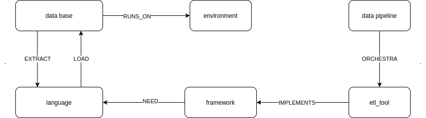

# Relatório do trabalho: KRR
- **Nome:** Bruno Aurélio Rôzza de Moura Campos
- **Matéria:** INE5633-07238 (20201) - Sistemas Inteligentes

1. **Uma breve descrição do domínio da ontologia**

O domínio da ontologia é um processo de ETL (extract-transform-load). O funcionamento está descrito na imagem abaixo:

 
 
 

2. Principais classes e suas restrições

- A 1ª classe **data\_pipeline** é abstrata.
- A 2ª classe **etl\_tool** tem como instâncias: 
  - Apache airflow
  - Apache Nifi

` `exige exatamente 1 etl\_tool para ser orquestrada.

- A 3ª classe **framework** tem como instâncias:
  - Apache Storm
  - Hadoop MapReduce

Exige exatamente 1 framework para ser implementada

- A classe **database** tem como instâncias:
  - Apache Cassandra
  - Postgres

Exige exatamente 1 environment para rodar sobre ele (runs\_on)

Exige exatamente 1 language para carregar os dados (load\_with)

Exige exatamente 1 database para extrair os dados (extract\_to)

OBS: aqui pensei no seguinte cenário, poderá acontecer a situação de o banco de dados não existir, então neste caso o que preciso para carregar os dados é no mínimo de uma linguagem de programação pois assim poderei criar na hora.

A classe **environment** tem como instâncias:
- Aws
- Local

Não possui restrições.

A classe **language** tem como instâncias:
- Java
- Python

Não possui restrições.

---

3. **Principais relações e suas restrições**

**runs\_on**

- Domínio: database
- Imagem: environment

**load\_with**

- Domínio: language
- Imagem: database
- Inverso de extract\_with, assim como esta na imagem 1

**extract\_with**

- Domínio: database
- Imagem: language
- Inverso de **load\_with**, assim como esta na imagem 1

**orchestra**

- Domínio: data\_pipeline
- Imagem: etl\_tool

**implements**

- Domínio: etl\_tool
- Imagem: framework

**need**

- Domínio: framework
- Imagem: language

---

4. **Testes realizados com indivíduos**

Para testar as restrições adicionei os seguintes indivíduos:
- Azure, testa o environment e suas restrições
- Scala, testa a language e suas restrições
- Apache\_hbase, testa o database e suas restrições
- Apache\_oozie, testa o etl\_tool e suas restrições
- Apache\_flink, testa o framework e suas restrições

---

5. **O que não funcionou**

Não consegui resolver um problema, que é na classe de database. Um database erroneamente esta recebendo como subclasse: **language**. 

Isso acontece porque:
- Database EquivalentTo load\_with exactly 1 language
