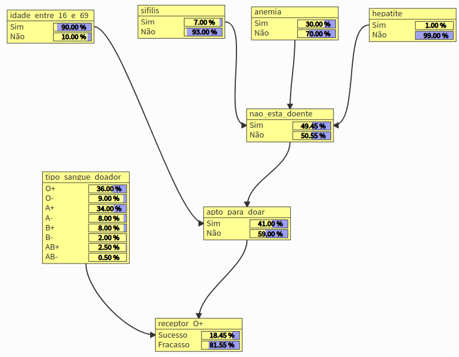
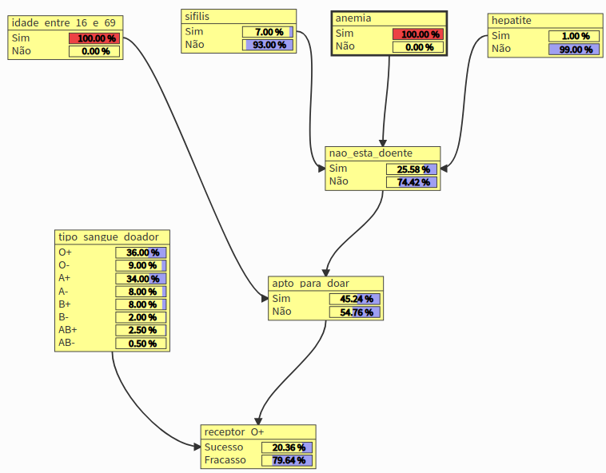
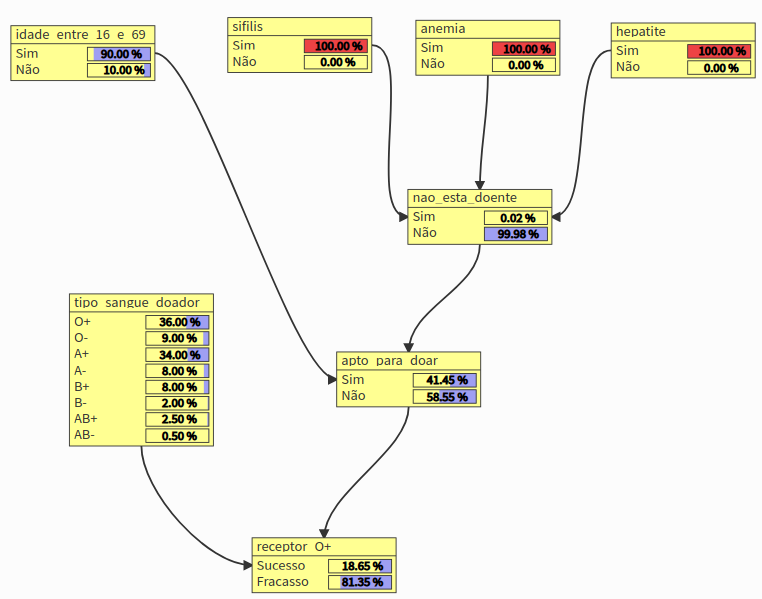
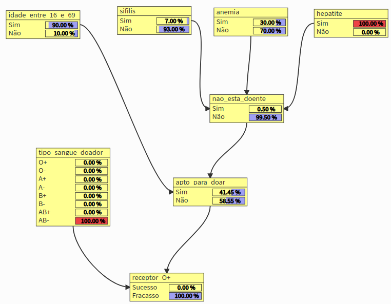

# Relatório Trabalho 03: Redes Bayesianas

#### Alunos
- Bruno Aurélio Rôzza de Moura Campos (14104255)

#### Ferramenta Utilizada
- [Editor de rede baysiana](https://nolleto.github.io/bayesjs-editor/)

**Explique a fonte dos valores de probabilidade (mesmo que seja sua experiência própria), os motivos das relações, quais nodos são independentes e por quê. Explicação breve!** 

- O contexto da rede baysiana é a probabilidade de uma doação de sangue ser bem sucedida para um tipo de sangue em expecífico (O+). A uma série de condições para que seja feita a doação e alem disso há ainda a questão da compatibilidade entre os tipos sanguíneos.
- Probabilidades:
  - [Probabilidade de Hepatite](https://www.paho.org/bra/index.php?option=com_content&view=article&id=5404:novos-dados-sobre-hepatites-destacam-necessidade-de-uma-resposta-global-urgente&Itemid=812#:~:text=A%20preval%C3%AAncia%20da%20hepatite%20C,%25%20da%20popula%C3%A7%C3%A3o%20(11%20milh%C3%B5es))
  - [Probabilidade de anemia](http://www.cremepe.org.br/2007/12/09/anemia-afeta-30-da-populacao-mundial/#:~:text=A%20Organiza%C3%A7%C3%A3o%20Mundial%20de%20Sa%C3%BAde,exig%C3%AAnio%20dos%20pulm%C3%B5es%20aos%20tecidos.)
  - [Probabilidade de sífilis](https://www.scielo.br/scielo.php?script=sci_arttext&pid=S1415-790X2014000200341&lng=pt&nrm=iso&tlng=pt)
  - [Probabilidades dos tipos sanguíneos](https://pt.wikipedia.org/wiki/Grupo_sangu%C3%ADneo)
  - [Compatibilidade dos tipo sanguíneos](http://www.prosangue.sp.gov.br/artigos/quem_doa_pra_quem.html)
- Nodos independentes:
  - idade_entre_16_e_69
  - sifilis
  - anemia
  - hepatite
  - tipo_sangue_doador
- Nodos dependentes:
  - nao_esta_doente
  - apto_para_doar
  - receptor_O+

**Utilize o mecanismo de inferência das redes bayesianas e faça experimentos com evidências nos nodos:**
1. **Descreva o significado da(s) evidência(s) para o domínio**
- As evidências são as condições para doar sangue
  - idade_entre_16_e_69
  - sifilis
  - anemia
  - hepatite
  - tipo_sangue_doador

- Depois de definido as probabilidades de cada doença, é centralizado em **nao_esta_doente** para controlar melhor as probabilidades. Em seguida, é calculado a probabilidade conjunta do **nao_esta_doente** com **idade_entre_16_e_69** para saber se o doador esta **apto_para_doar**. Por fim, é classificado a doação em **receptor_O+**, levando em conta se o doador esta apto_para_doar e se o **tipo_sangue_doador** é compatível, no caso de O+, só poderá receber de O+ ou O-.

 

2. **Descreva os resultados mais importantes para o tópico escolhido e interprete esses resultados.**

- Para o tópico escolhido é importante saber se o doador esta apto para doar e qual o seu tipo sanguíneo.
- Um ponto importante é saber se um doador esta **apto_para_doar**. Isto depende do **nao_esta_doente** e da **idade_entre_16_e_69**
- Resultados:'

 

 

  - nao_esta_doente: a partir das 3 doenças, sifilis, anemia e hepatite se tem 49,45% de chance de o doador não esta doente. 
  - apto_para_doar: a partir do histórico de doenças e da análise da idade entre 16 até 69 anos se tem 41% de change de realizar uma doação.
  - receptor_O+: tem sangue O+. A doação só dará sucesso se,
    - tipo_sangue_doador for iagual a O+ e O-
    - apto_para_doar for Sim

 

3. **No mínimo, realize os seguintes experimentos:**
  - Influência na propagação de evidência entre dois nodos independentes
    

  - Influência de evidência em um nodo independente nos demais nodos relacionados
  

  - Influência de duas ou mais evidências e seu impacto na rede
    

  - Influência de duas ou mais evidências com pouca chance de ocorrência e seu impacto na rede
    
