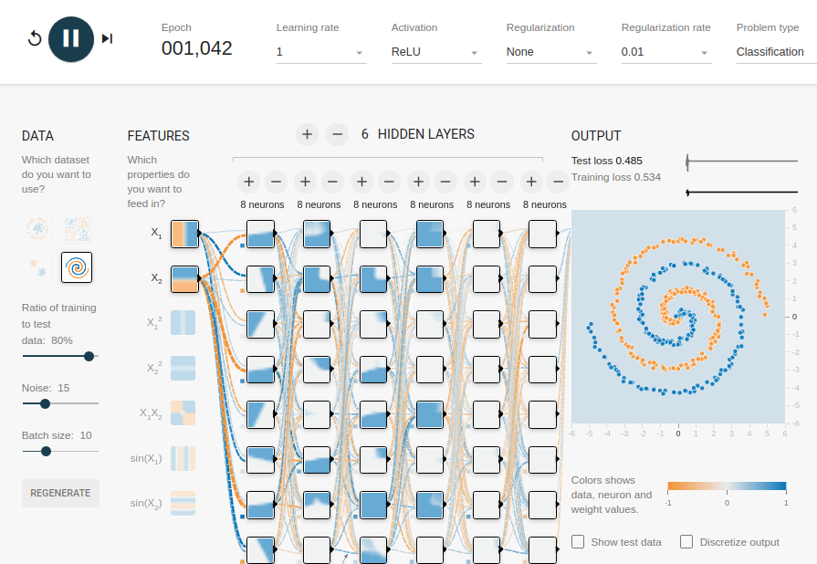

# Atividade Teórica 3: Redes Neurais

- Bruno Aurélio Rôzza de Moura Campos (14104255)
- Sistemas Inteligentes
- Prof. Elder Rizzon Santos
- Universidade Federal de Santa Catarina
- Sistemas de Informação

1. **Na demonstração [Playground](https://playground.tensorflow.org/) do Tensorflow, aparecem duas medidas como saída do treinamento: Training Loss (Perda do Treinamento) e Test Loss (Perda do Teste). Test Loss refere-se ao conjunto de testes da rede, pesquise, compreenda e explique brevemente (5 linhas) qual o propósito e como é utilizado o conjunto de testes para o treinamento de uma RN.**

Uma rede neural artificial (RNA) é treinada com um conjunto de dados de treinamento, geralmente 80 % do total de dados. Isto é útil para ajustar os parâmetros como os pesos da RNA. Depois de treinar uma RNA é necessário avaliar a sua qualidade de predição ou classificação para saber o quão bem a RNA generaliza, para isso se utiliza um conjunto de dados de testes, geralmente 20% do total de dados.

---

2. **Ainda quanto ao conjunto de testes e essa demonstração, como funciona o parâmetro “Ratio of Training to Test Data” (Taxa de Dados de Treinamento vs Teste)? (Resposta em 2 linhas)**

É o parâmetro que divide o conjunto de dados entre treinamento e teste. É comum se utilizar 80% para treinamento e 20% para testes.

---

3. **Na demonstração, escolha algum dos conjuntos de dados (DataSets) disponíveis, adicione ruído (entre 10 e 20) no conjunto (Noise), defina uma configuração de Rede Neural a seu critério e verifique qual o desempenho (treino e teste) da rede utilizando-se as taxas de aprendizagem 3, 1 e 0.1.**

**Taxa de aprendizagem = 3**

- Test loss 0.497
- Training loss 0.501

**Taxa de aprendizagem = 1**

- Test loss 0.485
- Training loss 0.534

**Taxa de aprendizagem = 0.1**

- Test loss 0.000
- Training loss 0.005

**Função de ativação:**

- RNA com a função ReLU são fáceis de otimizar, já que a ReLU é extremamente parecida com a função identidade. 
- Geralmente vejo os modelos de deep learning usando ReLU
- Para uma classificação binária é a função de ativação mais adequada

**Sobre a quantidade de camadas:**

- Segundo Ian Goodfellow, autor das generative adversarial networks, a acurácia aumenta com o aumento de camadas ocultas. Fonte: <https://www.iangoodfellow.com/slides/learn_ai_with_the_best.pdf>

**Taxa de Regularização:**

- Utilizei para tornar a distribuição dos pesos mais regular em toda a rede e como consequência mitigar um overfit.

---

4. **Nessa demonstração e nas aulas, abordamos a aprendizagem supervisionada, apresente brevemente uma aplicação e uma arquitetura de RN que utilize aprendizagem não supervisionada. Para a aplicação + rede escolhida, qual a principal métrica de avaliação e o que ela significa? (até 10 linhas)**

**Aplicação e arquitetura:** A aplicação pode ser a resolução do problema de classificação de imagens, exemplo clássico MNIST. A arquitetura da RNA que é não supervisionada  e resolve o problema de classificação de imagens é a **generative adversarial network (GAN)**, criado pelo Ian Goodfellow.

Para uma avaliação qualitativa é possível utilizar a técnica de vizinhos mais próximos a partir de exemplos de imagens reais do domínio em questão.

Para uma avaliação quantitativa: Pontuação inicial e Distância de início de Frechet. Essas medidas captam a qualidade e a diversidade das imagens geradas, tanto isoladas (primeiras) quanto comparadas com imagens reais (últimas).

#### Fonte
- <https://machinelearningmastery.com/how-to-evaluate-generative-adversarial-networks/>
